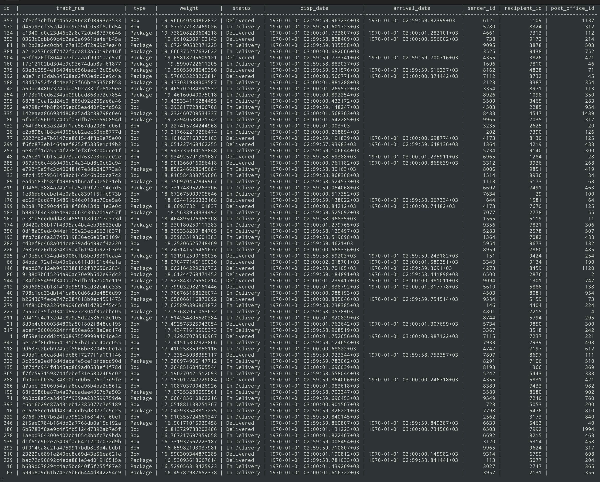
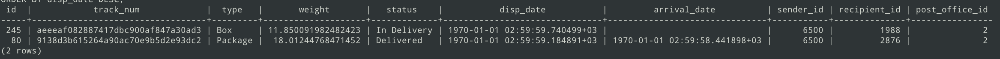
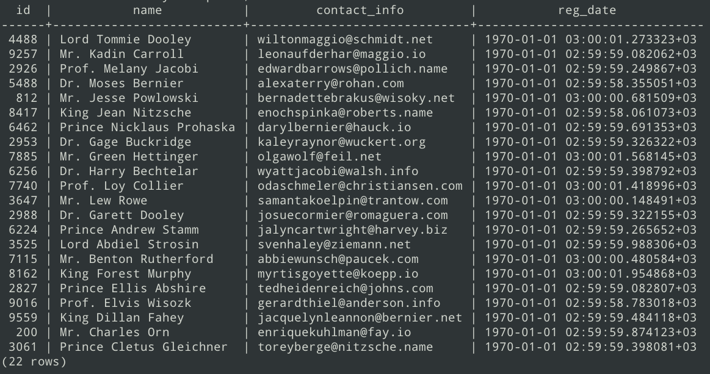
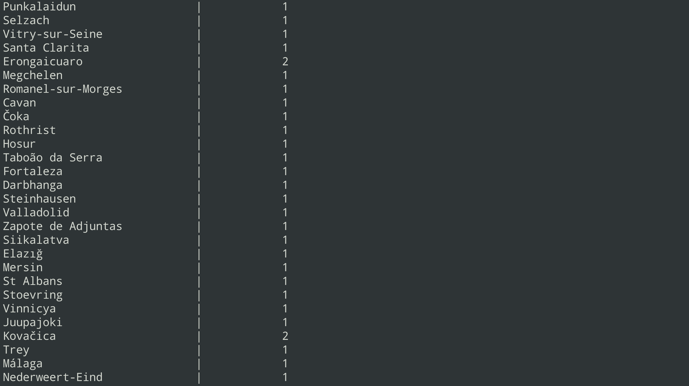
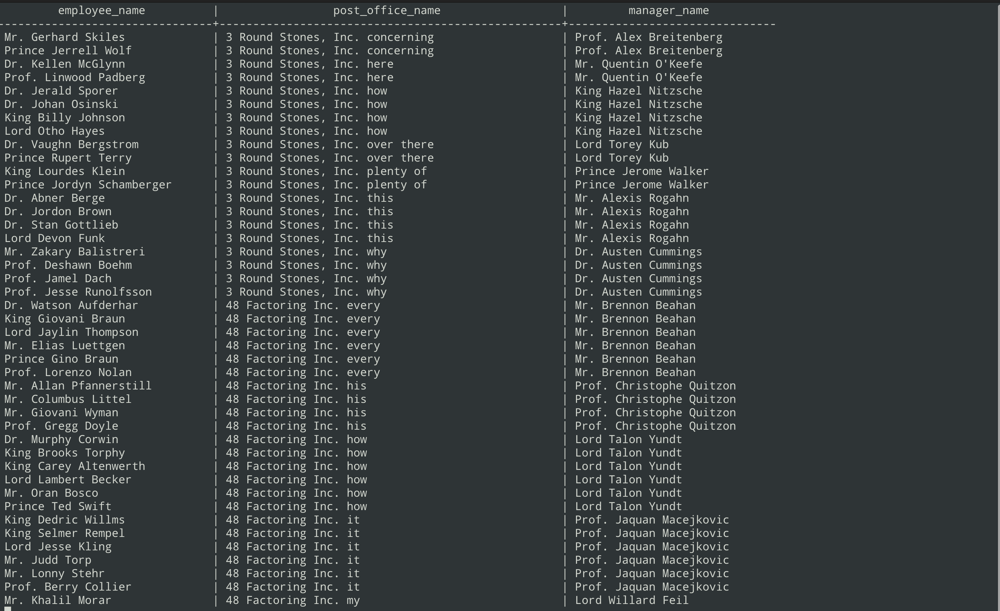
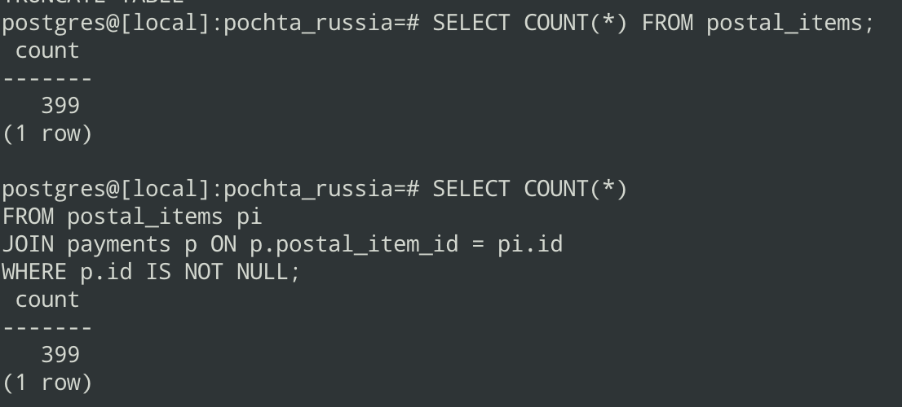

# Простые запросы

1. **Сортировка отправлений по убыванию веса, где вес превышает 1 кг**
```SQL
SELECT * 
FROM postal_items
WHERE weight > 1
ORDER BY weight DESC;
```


2. Просмотр всех отправлений для указанного почтового отделения с сортировкой по дате
```SQL
SELECT * 
FROM postal_items
WHERE post_office_id = <id>
ORDER BY disp_date DESC;
```



3. Получение всех клиентов из конкретной страны
```SQL
SELECT customers.* 
FROM customers
JOIN addresses ON addresses.customer_id = customers.id
WHERE addresses.country = '<Country>';
```


4. Подсчёт числа клиентов в каждом городе
```SQL
SELECT addresses.city, COUNT(*) AS client_count
FROM addresses
GROUP BY addresses.city;
```


# Средние запросы

1. Получить список всех подчиненных, офис, и их начальника.
```SQL
SELECT e.Name AS employee_name,
       po.Name AS post_office_name,
       m.Name AS manager_name
FROM employees e
JOIN post_offices po ON po.id = e.post_office_id
LEFT JOIN employees m ON m.position = 'Director' AND m.post_office_id = e.post_office_id
WHERE m.Name IS NULL OR m.Name != e.Name  
ORDER BY po.name, e.name;
```


2. Перечень отделений и сотрудников, работающих в них, с подсчётом количества сотрудников
```SQL
SELECT post_offices.name AS post_office_name, COUNT(employees.id) AS employee_count
FROM employees
JOIN post_offices ON post_offices.id = employees.post_office_id
GROUP BY post_offices.id;
```


3. Рассчёт среднего веса отправлений в каждом отделении
```SQL
SELECT post_offices.name AS post_office_name, AVG(postal_items.weight) AS avg_weight
FROM postal_items
JOIN post_offices ON post_offices.id = postal_items.post_office_id
GROUP BY post_offices.id;
```


4. Статистика по странам с числом отправителей и средним весом их отправлений
```SQL
SELECT
    a.country,                             
    COUNT(DISTINCT c.id) AS client_count,  
    AVG(pi.weight) AS avg_weight
FROM customers c
JOIN addresses a ON a.customer_id = c.id
JOIN postal_items pi ON pi.sender_id = c.id
GROUP BY a.country
ORDER BY client_count DESC;
```


5. Поиск всех сотрудников, которые не обрабатывали отправления в течение последних 30 дней
```SQL
SELECT 
    e.name AS employee_name,
    po.name AS post_office_name
FROM employees e
JOIN post_offices po ON po.id = e.post_office_id
LEFT JOIN status_transactions st ON st.employee_id = e.id
WHERE st.status_date IS NULL OR st.status_date < NOW() - INTERVAL '30 DAY'
ORDER BY e.name;
```


6. Запрос для получения статистики по состояниям товаров с информацией о клиентах и почтовых отделениях
```SQL
SELECT 
    pi.id AS postal_item_id, 
    pi.track_num AS track_number, 
    pi.type AS item_type,
    pi.weight AS item_weight,
    ps.status_name AS current_status,
    MAX(st.status_date) AS last_status_date,
    COUNT(st.id) AS total_status_changes,
    c_sender.name AS sender_name,
    c_recipient.name AS recipient_name,
    po.name AS post_office_name,
    addr.city AS post_office_city,
    addr.country AS post_office_country
FROM 
    postal_items pi
JOIN 
    status_transactions st ON st.postal_item_id = pi.id
JOIN 
    postal_statuses ps ON ps.id = st.status_id
JOIN 
    customers c_sender ON c_sender.id = pi.sender_id
JOIN 
    customers c_recipient ON c_recipient.id = pi.recipient_id
JOIN 
    post_offices po ON po.id = pi.post_office_id
JOIN 
    addresses addr ON addr.id = po.address_id
GROUP BY 
    pi.id, c_sender.name, c_recipient.name, po.id, addr.city, addr.country, ps.status_name
ORDER BY 
    last_status_date DESC;
```


# Сложные запросы

1. Запрос для получения всех клиентов, которые не оплатили отправление, и суммы их задолженности, сгруппированные по почтовым отделениям
```SQL
SELECT 
    post_offices.name AS post_office_name, 
    customers.name AS customer_name, 
    SUM(postal_items.weight * 200) AS total_weight
FROM customers
JOIN postal_items 
    ON postal_items.sender_id = customers.id
LEFT JOIN payments 
    ON payments.postal_item_id = postal_items.id
JOIN post_offices 
    ON post_offices.id = postal_items.post_office_id
WHERE payments.id IS NULL
GROUP BY post_offices.id, post_offices.name, customers.id, customers.name;
```
Выведет ноль, так как в функции добавления платежей, у меня все отправления оплачиваются 
.


2. Запрос выведет таблицу с информацией о всех отправлениях, которые были отправлены не более 1000 дней назад, и их аттрибутами
```SQL
WITH StatusDetails AS (
    SELECT 
        pi.id AS postal_item_id,
        ps.status_name,
        st.status_date,
        ROW_NUMBER() OVER (PARTITION BY pi.id ORDER BY st.status_date DESC) AS rn
    FROM postal_items pi
    JOIN status_transactions st ON st.postal_item_id = pi.id
    JOIN postal_statuses ps ON ps.id = st.status_id
),
PaymentStatus AS (
    SELECT 
        pi.id AS postal_item_id,
        CASE 
            WHEN p.id IS NOT NULL THEN 'Paid'
            ELSE 'Unpaid'
        END AS payment_status
    FROM postal_items pi
    LEFT JOIN payments p ON p.postal_item_id = pi.id
),
PostOfficeWeight AS (
    SELECT 
        pi.post_office_id,
        SUM(pi.weight) AS total_weight
    FROM postal_items pi
    GROUP BY pi.post_office_id
),
FilteredStatus AS (
    SELECT postal_item_id, status_name, status_date
    FROM StatusDetails
    WHERE rn = 1
)
SELECT DISTINCT
    pi.track_num, 
    po.name AS post_office_name,
    pi.weight,
    RANK() OVER (PARTITION BY pi.post_office_id ORDER BY pi.weight DESC) AS position,
    fs.status_name AS last_status,
    fs.status_date AS last_status_date,
    ps.payment_status,
    po_weight.total_weight,
    (pi.weight / po_weight.total_weight) * 100 AS weight_percentage
FROM postal_items pi
JOIN post_offices po ON po.id = pi.post_office_id
JOIN FilteredStatus fs ON fs.postal_item_id = pi.id
JOIN PaymentStatus ps ON ps.postal_item_id = pi.id
JOIN PostOfficeWeight po_weight ON po_weight.post_office_id = pi.post_office_id
WHERE pi.disp_date >= NOW() - INTERVAL '1000000 days'
ORDER BY 
    pi.track_num,
    po.name,            
    pi.weight,            
    position;             
```


3. Поиск клиентов с самыми дорогими отправлениями, которые еще не были оплачены
```SQL
SELECT 
    c.name AS customer_name,
    pi.track_num,
    pi.weight * 200 AS price,
    COALESCE(SUM(p.amount), 0) AS paid_amount,
    (pi.weight * 200) - COALESCE(SUM(p.amount), 0) AS debt
FROM customers c
JOIN postal_items pi ON pi.sender_id = c.id
LEFT JOIN payments p ON p.postal_item_id = pi.id
WHERE p.id IS NULL 
GROUP BY c.id, pi.id
HAVING (pi.weight * 200) > COALESCE(SUM(p.amount), 0)
ORDER BY debt DESC;
```
Опять же ничего не выведет, так как все отправления всегда оплачены (можно в цикле создавать меньше платежек, и убрать ограничение на проверку оплаты посылки)

4. Найти отправления с наибольшими задержками, сгруппированные по статусам, включая информацию о сотрудниках и почтовых отделениях
   ```SQL 
    WITH DelayedItems AS (
        SELECT 
            pi.id AS postal_item_id,
            pi.track_num,
            pi.disp_date,
            pi.arrival_date,
            EXTRACT(DAY FROM CURRENT_DATE - pi.arrival_date) AS delay_days,
            pi.status AS postal_item_status,
            pi.post_office_id
        FROM postal_items pi
        WHERE pi.arrival_date IS NOT NULL
        AND NOT EXISTS (
            SELECT 1
            FROM status_transactions st
            JOIN postal_statuses ps ON ps.id = st.status_id
            WHERE st.postal_item_id = pi.id AND ps.status_name = 'Delivered'
        )
    )
    SELECT 
        di.track_num,
        di.delay_days,
        di.postal_item_status,
        po.name AS post_office_name,
        e.name AS employee_name,
        ps.status_name AS current_status
    FROM DelayedItems di
    JOIN post_offices po ON po.id = di.post_office_id
    JOIN status_transactions st ON st.postal_item_id = di.postal_item_id
    JOIN employees e ON e.id = st.employee_id
    JOIN postal_statuses ps ON ps.id = st.status_id 
    WHERE st.status_date = (SELECT MAX(status_date) FROM status_transactions WHERE postal_item_id = di.    postal_item_id)
    ORDER BY di.delay_days DESC;
    ```
    

5. Запрос извлекает информацию о статусах транзакций для определенного товара
```SQL
SELECT
    pi.id AS postal_item_id,
    pi.track_num AS track_number,
    ps.status_name AS status_name,
    MAX(st.status_date) AS last_status_date,
    e.name AS employee_name,
    e.position AS employee_position,
    po.name AS post_office_name,
    COUNT(st.id) AS total_transactions
FROM
    status_transactions st
JOIN postal_items pi ON st.postal_item_id = pi.id
JOIN postal_statuses ps ON st.status_id = ps.id
JOIN employees e ON st.employee_id = e.id
JOIN post_offices po ON e.post_office_id = po.id
WHERE
    pi.id = 2
GROUP BY
    pi.id, pi.track_num, ps.status_name, e.name, e.position, po.name
ORDER BY
    last_status_date DESC;
```

